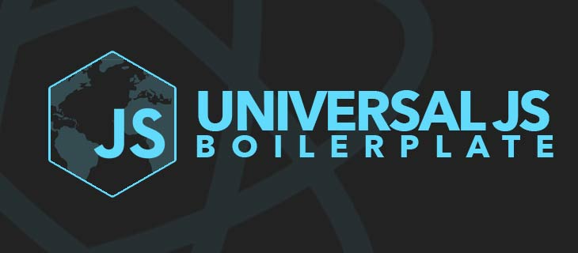

# UniversalJS Boilerplate



A boilerplate to quick start JavaScript Isomorphic Web Applications

## Technology Stack

* **[ES2015 / ECMAScript 6th Edition](https://babeljs.io/docs/learn-es2015/)** - the upcoming version of the ECMAScript standard.
* **[Babel](https://babeljs.io/)** - Next generation JavaScript, today.
* **[Browserify](http://browserify.org/)** - Browserify lets you require('modules') in the browser by bundling up all of your dependencies.
* **[React](http://facebook.github.io/react/)** - A JavaScript library for building user interfaces.
* **[React Router](http://rackt.github.io/react-router/)** - Complete routing solution designed specifically for React.js.
* **[React Engine](https://github.com/paypal/react-engine)** - A composite render engine for isomorphic express apps to render both plain react views and react-router views.
* **[Stylus](https://learnboost.github.io/stylus/)** - Expressive, dynamic, robust CSS
* **[NodeJS](https://nodejs.org/)** - Platform built on Chrome's JavaScript runtime for easily building fast, scalable network applications.
* **[Express](http://expressjs.com/)** - Fast, unopinionated, minimalist web framework for Node.js.
* **[Gulp](http://gulpjs.com/)** - Automate and enhance your workflow.

## Requirements and Install

Node.js v0.10.33 installed at least.

```
$ npm install -g gulp@3.9.0
$ npm install -g babel browserify nodemon
$ npm install
$ npm run build
$ npm start
```

And open your browser on `http://localhost:3000`

## Folder structure

```
.
├── /build/                   # Transpiled and minifiqued output files.
├── /docs/                    # Documentation about your project.
├── /node_modules/            # Node Modules and 3rd-party libraries.
├── /src/                     # Source code of the web application.  
│   ├── /app/                 # Isomorphic App source code.
│   │   ├── /client/          # Client-side startup script.
│   │   ├── /server/          # Server-side startup script.
│   │   ├── /shared/          # Shared components between Client-Server.
│   │   │   ├── /components/  # React components.
│   │   │   └── routes.js     # Shared routes between Client-Server.
│   │   └── config.js         # App config (URLs, names, etc...).
│   └── /styles/              # Stylesheets coding with Stylus Preprocessor.
├── gulpfile.babel.js         # Config file for automated Builders.
├── package.json              # App manifest and list of libraries installed.
├── .editorconfig             # define and maintain consistent coding styles.
├── .eslintrc                 # ECMAScript 6 and React linter.
├── .jscsrc                   # JavaScript code styles
└── .stylintc                 # Stylus CSS code style
```

## License

Open Source. [MIT](LICENSE) &copy; Carlos Azaustre
